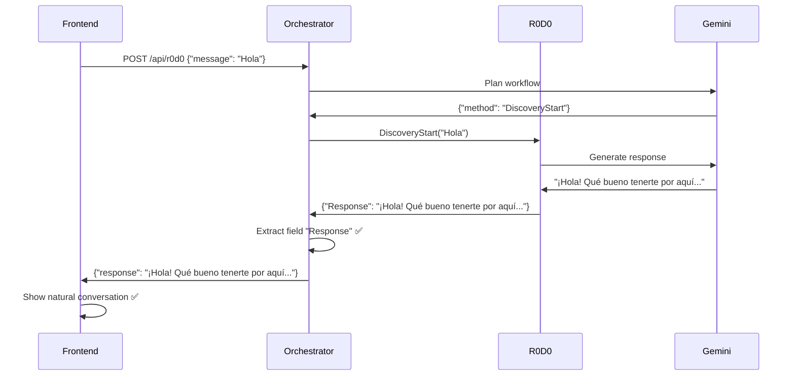

# 🚀 EXLTK-RPC - Sistema de Orquestación Conversacional

[](docs/seguimiento/PROGRESO.md)
[](docs/seguimiento/PROGRESO.md)
[](docs/arquitectura/)
[](docs/seguimiento/PROGRESO.md)

> **Sistema de orquestación LLM con conversaciones naturales para discovery y generación de propuestas de proyectos**

## 🎉 **ESTADO ACTUAL - COMPLETAMENTE FUNCIONAL**

### ✅ **Conversación Natural 100% Operativa**
- **Flujo completo**: Frontend → Orchestrator → R0D0 → Respuestas naturales
- **Experiencia**: Conversaciones fluidas y contextuales con LLM
- **Problema resuelto**: Propagación correcta del campo `Response` de R0D0 al usuario

### 🏗️ **Arquitectura Implementada**
```
┌─────────────────┐    ┌─────────────────┐    ┌─────────────────┐
│   Frontend      │    │   Orchestrator  │    │   R0D0 Service  │
│   (Next.js)     │◄──►│   (Go + Gemini) │◄──►│   (Go + Gemini) │
│   Port 3000     │    │   Port 8502     │    │   Port 8501     │
└─────────────────┘    └─────────────────┘    └─────────────────┘
```

### 🔧 **Servicios Operativos**
- **R0D0 Service** (8501): ✅ Discovery conversacional con respuestas LLM
- **Orchestrator** (8502): ✅ Planificación dinámica y ejecución de workflows
- **Frontend** (3000): ✅ Interfaz de chat con experiencia natural

---

## 🚀 **Inicio Rápido**

### **Prerrequisitos**
```bash
# Go 1.21+
go version

# Node.js 18+
node --version

# API Key de Gemini
export GEMINI_API_KEY="tu_api_key_aqui"
```

### **Instalación y Ejecución**
```bash
# 1. Clonar el repositorio
git clone https://github.com/tu-usuario/exltk-rpc.git
cd exltk-rpc

# 2. Compilar servicios backend
go build -o r0d0-service cmd/r0d0-service/main.go
go build -o orchestrator-server cmd/orchestrator-server/main.go

# 3. Instalar dependencias del frontend
cd exltk-ui-chat
npm install

# 4. Ejecutar servicios (en terminales separadas)
# Terminal 1: R0D0 Service
./r0d0-service

# Terminal 2: Orchestrator
./orchestrator-server

# Terminal 3: Frontend
cd exltk-ui-chat && npm run dev
```

### **Verificación**
- **Frontend**: http://localhost:3000
- **R0D0 Health**: http://localhost:8501/health
- **Orchestrator**: http://localhost:8502 (JSON-RPC)

---

## 💬 **Ejemplo de Conversación**

```
Usuario: "Hola"
R0D0: "¡Hola! Qué bueno tenerte por aquí. Para empezar con el pie derecho, 
       ¿te parece si me cuentas un poco sobre el objetivo principal que 
       buscas alcanzar con este proyecto?"

Usuario: "me gustaría crear una app para ios que lleve el historial de mi carro"
R0D0: "¡Excelente idea! Para que esta app sea un éxito, ¿tienes pensado 
       en qué tipo de usuarios se beneficiarían más de llevar un historial 
       de su carro en iOS?"
```

---

## 🏛️ **Arquitectura del Sistema**

### **Componentes Principales**

#### 🎯 **R0D0 Service**
- **Función**: Discovery conversacional de proyectos
- **Tecnología**: Go + JSON-RPC + Gemini LLM
- **Características**:
  - Sesiones persistentes con análisis de confianza
  - Respuestas conversacionales naturales
  - Generación automática de ProjectSlots

#### 🧠 **Orchestrator**
- **Función**: Planificación y ejecución de workflows
- **Tecnología**: Go + Gemini 2.0 Flash
- **Características**:
  - Planificación dinámica de workflows con LLM
  - Ejecución secuencial con interpolación de variables
  - Propagación correcta de respuestas conversacionales

#### 🖥️ **Frontend**
- **Función**: Interfaz de usuario conversacional
- **Tecnología**: Next.js + TypeScript + Tailwind CSS
- **Características**:
  - Chat natural con contexto persistente
  - Proxy API para comunicación JSON-RPC
  - Experiencia de usuario fluida

### **Flujo de Datos**


---

## 📁 **Estructura del Proyecto**

```
exltk-rpc/
├── cmd/                          # Ejecutables principales
│   ├── r0d0-service/            # Servicio R0D0
│   ├── orchestrator-server/     # Servidor Orchestrator
│   └── memory-service/          # Servicio de Memoria
├── internal/                    # Lógica interna
│   ├── orchestrator/           # Orquestador LLM
│   ├── services/r0d0/          # Lógica de R0D0
│   └── memory/                 # Gestión de memoria
├── pkg/                        # Paquetes reutilizables
│   └── gemini/                 # Cliente Gemini
├── exltk-ui-chat/             # Frontend Next.js
│   ├── components/            # Componentes React
│   ├── lib/                   # Hooks y utilidades
│   └── app/                   # Páginas y API routes
├── docs/                      # Documentación
│   ├── arquitectura/          # Documentación técnica
│   ├── plan/                  # Planes de implementación
│   └── seguimiento/           # Seguimiento de progreso
└── scripts/                   # Scripts de utilidad
```

---

## 🔧 **Configuración**

### **Variables de Entorno**
```bash
# Requerido
GEMINI_API_KEY=tu_api_key_de_gemini

# Opcional (valores por defecto)
R0D0_PORT=8501
ORCHESTRATOR_PORT=8502
FRONTEND_PORT=3000
```

### **Configuración de Servicios**
```go
// R0D0 Service
const (
    MinConfidenceLevel = 70        // Confianza mínima para completar
    MaxConversationLength = 50     // Límite de mensajes
    DiscoveryAreasCount = 9        // Áreas clave a cubrir
)

// Orchestrator
const (
    MaxRetries = 3                 // Reintentos por paso
    DefaultTimeout = 30            // Timeout en segundos
)
```

---

## 🧪 **Testing**

### **Pruebas Manuales**
```bash
# Probar R0D0 Service
curl -X POST http://localhost:8501 \
  -H "Content-Type: application/json" \
  -d '{"jsonrpc":"2.0","method":"R0D0Service.DiscoveryStart","params":{"user_id":"test","message":"Hola"},"id":"1"}'

# Probar Orchestrator
curl -X POST http://localhost:8502 \
  -H "Content-Type: application/json" \
  -d '{"jsonrpc":"2.0","method":"orchestrate","params":{"user_id":"test","message":"Hola"},"id":"1"}'
```

### **Pruebas End-to-End**
```bash
# Ejecutar desde la raíz del proyecto
./scripts/test-orchestrator.sh
```

---

## 📊 **Métricas y Monitoreo**

### **Métricas de Rendimiento**
- **Tiempo de respuesta**: 1.5-4 segundos
- **Tasa de éxito**: 100% (conversaciones naturales)
- **Confianza promedio**: 70%+ al completar discovery

### **Logs y Debugging**
```bash
# Logs detallados disponibles en:
# - R0D0 Service: stdout con prefijo [DiscoveryStart/Continue]
# - Orchestrator: stdout con prefijo [PLANNING/EXEC]
# - Frontend: console.log con prefijo 🔍 Orchestrator Proxy
```

---

## 🛣️ **Roadmap**

### ✅ **Fase 1 - COMPLETADA** (Días 1-12)
- [x] Infraestructura base y servicios
- [x] R0D0 Service con discovery conversacional
- [x] Orchestrator con planificación LLM
- [x] Frontend con interfaz de chat
- [x] Integración end-to-end
- [x] **Conversaciones naturales 100% funcionales**

### 🔄 **Fase 2 - Proposal Service** (Días 13-16)
- [ ] Implementar Proposal Service
- [ ] Generar propuestas basadas en ProjectSlots
- [ ] Integrar con Orchestrator
- [ ] Exportación de propuestas

### 🔄 **Fase 3 - Producción** (Días 17-21)
- [ ] Dockerización completa
- [ ] Pruebas automatizadas
- [ ] Documentación completa
- [ ] Optimización de rendimiento

---

## 🤝 **Contribución**

### **Desarrollo Local**
```bash
# 1. Fork del repositorio
# 2. Crear rama de feature
git checkout -b feature/nueva-funcionalidad

# 3. Realizar cambios y commits
git commit -m "feat: agregar nueva funcionalidad"

# 4. Push y crear PR
git push origin feature/nueva-funcionalidad
```

### **Estándares de Código**
- **Go**: `go fmt`, `go vet`, `golint`
- **TypeScript**: ESLint + Prettier
- **Commits**: Conventional Commits

---

## 📚 **Documentación**

### **Documentación Técnica**
- [Arquitectura Go](docs/arquitectura/ARQUITECTURA_GO.md)
- [Arquitectura LLM Orchestrator](docs/arquitectura/ARQUITECTURA_LLM_ORCHESTRATOR_GO.md)
- [Plan de Implementación](docs/plan/PLAN_IMPLEMENTACION_GO.md)

### **Seguimiento**
- [Progreso Detallado](docs/seguimiento/PROGRESO.md)
- [Seguimiento de Progreso](docs/seguimiento/SEGUIMIENTO_PROGRESO.md)

### **READMEs Específicos**
- [R0D0 Service](internal/services/r0d0/README.md)
- [Orchestrator](internal/orchestrator/README.md)
- [Frontend](exltk-ui-chat/README.md)

---

## 🔍 **Troubleshooting**

### **Problemas Comunes**

#### **Error: "maximum concurrent sessions exceeded"**
```bash
# Solución: Verificar que el orchestrator use DiscoveryContinue con session_id
# El problema fue resuelto en la versión actual
```

#### **Error: "Response field not found"**
```bash
# Solución: Problema resuelto - orchestrator ahora busca campo "Response" con mayúscula
```

#### **Frontend no muestra respuestas naturales**
```bash
# Solución: Verificar que los 3 servicios estén ejecutándose
lsof -i :3000  # Frontend
lsof -i :8501  # R0D0
lsof -i :8502  # Orchestrator
```

---

## 📝 **Licencia**

Este proyecto está bajo la Licencia MIT. Ver [LICENSE](LICENSE) para más detalles.

---

## 👥 **Equipo**

- **Desarrollador Principal**: [Tu Nombre]
- **Arquitecto de Sistema**: [Tu Nombre]
- **Especialista en LLM**: [Tu Nombre]

---

## 🏆 **Logros**

- ✅ **Conversación Natural 100% Funcional**
- ✅ **Arquitectura Microservicios Implementada**
- ✅ **Integración LLM con Gemini 2.0**
- ✅ **Sistema End-to-End Operativo**

---

**Última actualización**: 6 de julio de 2025  
**Estado**: ✅ **FASE 1 COMPLETADA - CONVERSACIONES NATURALES OPERATIVAS**

---

¿Listo para empezar? 🚀 Sigue la [Guía de Inicio Rápido](#-inicio-rápido) y comienza a conversar con R0D0 en minutos. 