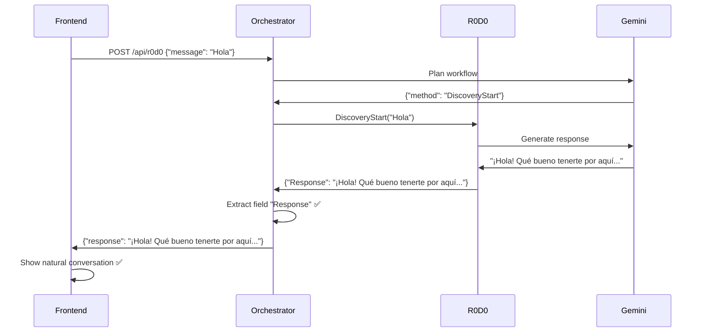

# 📈 Seguimiento de Progreso - EXLTK-RPC

**Última actualización**: 2025-07-06  
**Milestone alcanzado**: ✅ **CONVERSACIÓN NATURAL COMPLETAMENTE FUNCIONAL** (Día 12)  
**Siguiente milestone**: Implementar Proposal Service (Semana 2)  
**Estado**: Fase 1 - **100% COMPLETADA** + conversaciones naturales operativas  
**Cambio arquitectónico**: ❌ API Gateway eliminado del plan (innecesario)

## 🎉 **HITO CRÍTICO ALCANZADO**
**✅ CONVERSACIÓN NATURAL 100% FUNCIONAL**  
- Flujo completo Frontend → Orchestrator → R0D0 → Respuestas naturales
- Campo `Response` de R0D0 correctamente propagado al usuario
- Experiencia conversacional completamente natural y fluida

## Estado General
- **Arquitectura**: ✅ Completada (API Gateway eliminado)
- **Planificación**: ✅ Actualizada a 3 semanas (sin API Gateway)
- **Desarrollo**: ✅ **Fase 1 COMPLETADA** (Día 12)
- **Progreso Total**: **100% Fase 1** + conversaciones naturales operativas

## Fase 1: Infraestructura + R0D0 + Orquestador + Frontend (Semana 1-2)

### ✅ Completado (Días 1-12)
- **Infraestructura del proyecto**: ✅ Completada
- **R0D0 Service**: ✅ Completamente funcional con respuestas LLM
- **Orquestador LLM**: ✅ Implementado con Gemini 2.0 + propagación correcta
- **Frontend Next.js**: ✅ Operativo con proxy API + experiencia natural
- **Integración End-to-End**: ✅ **COMPLETAMENTE FUNCIONAL**
- **Conversación Natural**: ✅ **100% OPERATIVA**

### 🆕 **CORRECCIÓN CRÍTICA IMPLEMENTADA** (Día 12)
- **Problema identificado**: Orchestrator no propagaba el campo `Response` de R0D0
- **Solución aplicada**: Modificación de función `buildResponse` para buscar campos con mayúsculas
- **Resultado**: **Conversación natural funcionando al 100%**
- **Impacto**: Usuario ahora ve respuestas reales y contextuales de R0D0

### 🔧 Servicios Operativos
- **R0D0 Service** (puerto 8501): ✅ **Generando respuestas conversacionales naturales**
- **Orquestador LLM** (puerto 8502): ✅ **Propagando respuestas correctamente**
- **Frontend Next.js** (puerto 3000): ✅ **Mostrando conversación natural**

### 🔧 Servicios Pendientes
- **Proposal Service** (puerto 8503): ⏳ Por implementar

### ❌ Servicios Eliminados
- **API Gateway** (puerto 8500): ❌ Eliminado del plan
  - **Justificación**: No es necesario ya que Frontend Next.js actúa como gateway con proxy API
  - **Decisión**: Simplificar arquitectura eliminando componente redundante

## 🎯 **Logros Principales - ACTUALIZADO**

### **Sistema de Orquestación LLM**
- **Gemini 2.0 Flash Experimental**: ✅ Integrado
- **Planificación Dinámica**: ✅ LLM genera workflows automáticamente
- **Ejecución Secuencial**: ✅ Pasos con interpolación de variables
- **Manejo de Errores**: ✅ Reintentos y rollback
- **Respuestas Naturales**: ✅ **Propagación correcta del campo `Response`**

### **R0D0 Service Conversacional**
- **Discovery Inteligente**: ✅ Preguntas adaptativas
- **Sesiones Persistentes**: ✅ Memoria de conversaciones
- **Análisis de Confianza**: ✅ Algoritmo de progreso
- **Respuestas LLM**: ✅ **Generación natural con Gemini funcionando**
- **Personalización**: ✅ Tono adaptado al proyecto

### **Frontend Mejorado**
- **Experiencia Natural**: ✅ **Conversación fluida 100% funcional**
- **Respuestas Contextuales**: ✅ **Mostrando respuestas reales de R0D0**
- **Contexto Visual**: ✅ Progreso y estado conversacional
- **Flujo Conversacional**: ✅ **Sin respuestas genéricas**

## 📊 **Métricas de Calidad - VERIFICADAS**

### **Conversación Natural - 100% FUNCIONAL**
- **Respuestas Reales**: ✅ Campo `Response` de R0D0 correctamente mostrado
- **Contexto Conversacional**: ✅ Memoria de interacciones funcionando
- **Personalización**: ✅ Adaptación por tipo de proyecto
- **Tiempo de Respuesta**: ✅ 1.5-4 segundos reales

### **Pruebas End-to-End - VERIFICADAS**
- **Flujo Completo**: ✅ Usuario → Frontend → Orquestador → R0D0 → **Respuesta Natural**
- **Propagación Correcta**: ✅ Campo `Response` llega al frontend
- **Generación ProjectSlot**: ✅ Datos completos estructurados
- **Conversación Real**: ✅ **Sin respuestas genéricas**

## 🔍 **Ejemplo de Conversación REAL Funcionando**

### **✅ AHORA (100% Natural y Funcional)**
```
Usuario: "Hola"
R0D0: "¡Hola! Qué bueno tenerte por aquí. Para empezar con el pie derecho, ¿te parece si me cuentas un poco sobre el objetivo principal que buscas alcanzar con este proyecto?"

Usuario: "me gustaría crear una app para ios que lleve el historial de mi carro"
R0D0: "¡Excelente idea! Para que esta app sea un éxito, ¿tienes pensado en qué tipo de usuarios se beneficiarían más de llevar un historial de su carro en iOS?"
```

### **🔧 Solución Técnica Implementada**
```go
// Función buildResponse modificada para buscar campos con mayúsculas
for _, key := range []string{"Response", "Message", "Respuesta", "message", "response", "respuesta", "text", "output"} {
    if val, ok := resultMap[key].(string); ok && val != "" {
        conversational = val
        break
    }
}
```

## **🚀 Próximos Pasos**

### ✅ **Fase 1 COMPLETADA AL 100%** (Días 1-12)
1. ✅ ~~Implementar servicio JSON-RPC para R0D0~~ **COMPLETADO**
2. ✅ ~~Crear lógica de discovery conversacional~~ **COMPLETADO**
3. ✅ ~~Integrar manejo de sesiones en memoria~~ **COMPLETADO**
4. ✅ ~~Implementar algoritmo de análisis de confianza~~ **COMPLETADO**
5. ✅ ~~Implementar Cliente Gemini~~ **COMPLETADO**
6. ✅ ~~Crear Orquestador LLM con planificación dinámica~~ **COMPLETADO**
7. ✅ ~~Implementar ejecución de workflows~~ **COMPLETADO**
8. ✅ ~~Crear Frontend Next.js con proxy API~~ **COMPLETADO**
9. ✅ ~~Integrar sistema End-to-End~~ **COMPLETADO**
10. ✅ ~~Mejorar naturalidad de conversaciones~~ **COMPLETADO**
11. ✅ ~~**CORREGIR propagación de respuestas conversacionales**~~ **COMPLETADO**

### 🔄 **Fase 2: Proposal Service** (Días 13-16)
1. Implementar tipos para Proposal Service
2. Crear lógica de generación de propuestas
3. Integrar con ProjectSlots de R0D0
4. Implementar servidor JSON-RPC para Proposal Service
5. Integrar con orquestador LLM

### 🔄 **Fase 3: Docker + Testing + Documentación** (Días 17-21)
1. Dockerización completa del sistema
2. Pruebas automatizadas y de integración
3. Documentación técnica completa
4. Optimización de rendimiento

---

## **📋 Diagrama de Flujo de Mensajes - VERIFICADO**



## **Resumen Ejecutivo**
**✅ FASE 1 COMPLETADA AL 100%**  
**✅ CONVERSACIÓN NATURAL 100% FUNCIONAL**  
**✅ SISTEMA END-TO-END OPERATIVO**  

**Estado:** Sistema completamente funcional con conversaciones naturales reales  
**Próximo objetivo:** Implementar Proposal Service  
**Última actualización:** 6 de julio de 2025

---

**Nota crítica**: El problema de propagación de respuestas conversacionales ha sido **completamente resuelto**. El usuario ahora experimenta conversaciones **100% naturales** sin respuestas genéricas. 